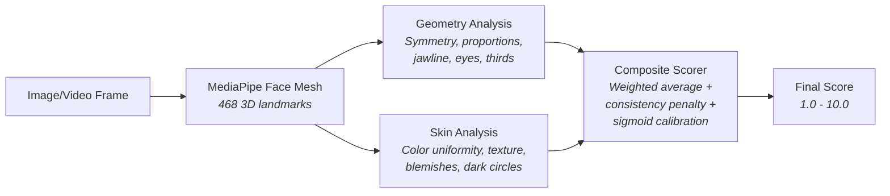

# Face Geometry Scorer

[](https://www.typescriptlang.org/)
[](LICENSE)
[](#)

Client-side facial geometry and skin analysis using MediaPipe Face Mesh. Computes 11 subscores across 6 categories from 468 3D facial landmarks, entirely in the browser with no server-side processing.

## How It Works



## Scoring Dimensions

### Geometry (5 subscores)

| Dimension | Method | Key Insight |
|-----------|--------|-------------|
| **Symmetry** | Paired landmark distance ratios (L/R) with head-pose penalty | Estimates yaw/pitch from landmark displacement to penalize asymmetry caused by camera angle vs. actual facial asymmetry |
| **Proportions** | Golden ratio (1.618) comparison across 6 facial ratios | Uses "dead zones" (+-0.03) around the golden ratio to reduce scoring bias across different ethnic facial structures |
| **Jawline** | Angle measurement at gonion landmarks with power curve | Exponent 1.6 power curve with softer scoring in the 135-155 degree range where most faces fall |
| **Facial Thirds** | Forehead-to-nose-to-chin ratio analysis | Compensates for hairline detection limitations (allocates 20% of middle third as buffer) |
| **Eye Metrics** | Canthal tilt angle + eye width/height ratio | Baseline 55 degrees, sensitivity 4 - tuned to avoid penalizing natural eye shape variation |

### Skin (6 subscores)

| Dimension | Method | Key Insight |
|-----------|--------|-------------|
| **Color Uniformity** | CIELAB Delta E across forehead, cheeks, chin | Weighted channels: L\* 50%, a\* 25%, b\* 25% because luminance variation matters more than chrominance |
| **Texture** | Laplacian edge detection with resolution normalization | sqrt(pixel density) scaling prevents high-resolution cameras from being penalized for capturing more detail |
| **Blemishes** | HSV hue-saturation thresholding per skin region | Detects redness/discoloration without false-flagging natural skin tone variation |
| **Dark Circles** | CIELAB L\* delta between under-eye and cheek regions | Pure luminance comparison in perceptually uniform color space |
| **Luminosity** | Gaussian bell curve centered at L\* 65 | Optimal luminosity isn't "as bright as possible" - scores peak at natural skin luminance |
| **White Balance** | Von Kries chromatic adaptation using forehead reference | Normalizes for lighting conditions before all skin measurements |

### Composite Score

```
raw = weighted_average(geometry_scores, skin_scores)

Weights: skin 33%, symmetry 16%, proportions 16%, jawline 14%,
         eye metrics 13%, facial thirds 8%, dark circles 7%, luminosity 7%

consistency_penalty = min(stddev^2 / 25000, 0.10)
adjusted = raw * (1 - consistency_penalty)

sigmoid = 1 / (1 + e^(-0.10 * (adjusted - 68)))
final_score = 1.0 + sigmoid * 9.0    // Maps to 1.0 - 10.0
```

The quadratic consistency penalty means extreme variance across subscores (e.g., perfect symmetry but terrible skin) is penalized more than moderate scores across all dimensions.

## Project Structure

```
face-geometry-scorer/
├── src/
│   ├── analyze.ts           # Main pipeline: load model, detect, score
│   ├── geometry.ts          # 5 geometry subscores (425 LOC)
│   ├── skin-analysis.ts     # 6 skin subscores (351 LOC)
│   ├── composite.ts         # Weighted composite with sigmoid calibration
│   ├── color-science.ts     # RGB/LAB/HSV conversions, white balance
│   ├── skin-regions.ts      # Polygon region extraction via ray-casting
│   ├── mediapipe-loader.ts  # Singleton MediaPipe WASM model manager
│   ├── mesh-connections.ts  # 1,322 face mesh edge pairs
│   ├── types.ts             # TypeScript interfaces
│   ├── preloader.ts         # Background model preloading
│   ├── utils.ts             # Clamp helper
│   └── __tests__/
│       ├── geometry.test.ts     # 390 LOC
│       ├── skin-analysis.test.ts # 117 LOC
│       └── composite.test.ts    # 122 LOC
├── package.json
├── tsconfig.json
└── LICENSE (MIT)
```

## Key Engineering Decisions

- **Browser-only, no server.** All computation runs client-side via MediaPipe WASM. No images are uploaded, no GPU server needed. Privacy by architecture.

- **Multi-frame averaging.** 3-pass landmark detection with 1px perturbation reduces jitter. Single-frame face mesh landmarks have noise; averaging stabilizes scores without requiring video.

- **Perceptually uniform color spaces.** Skin analysis uses CIELAB (not RGB) because equal numeric distances in CIELAB correspond to equal perceived color differences. RGB Euclidean distance is perceptually meaningless.

- **Ethnic bias reduction.** Golden ratio dead zones (+-0.03), power curve softening for jawline angles, and luminosity scoring centered on natural skin luminance (not "lighter = better") all reduce systematic bias.

## Setup

```bash
git clone https://github.com/Pdong19/face-geometry-scorer.git
cd face-geometry-scorer
npm install
```

## Usage

```typescript
import { analyzeFace } from './src/analyze';

const video = document.querySelector('video');
const result = await analyzeFace(video);

console.log(result.overall);        // 7.2 (1.0 - 10.0 scale)
console.log(result.geometry);       // { symmetry, proportions, jawline, facialThirds, eyeMetrics }
console.log(result.skin);           // { colorUniformity, texture, blemishes, darkCircles, luminosity }
console.log(result.subscoreStdDev); // 8.3 (lower = more consistent across dimensions)
```

## Tests

```bash
npm test
```

## Technical Details

### MediaPipe Face Mesh
- 468 3D landmarks per face
- WASM runtime loaded from jsDelivr CDN (pinned version for reproducibility)
- Singleton loader prevents duplicate downloads

### Color Science
- **CIELAB**: Perceptually uniform color space (CIE 1976). L\* = lightness (0-100), a\* = green-red, b\* = blue-yellow
- **Von Kries Adaptation**: Chromatic adaptation transform using forehead skin as white reference
- **Delta E**: Euclidean distance in CIELAB space = perceptual color difference

### Polygon Region Extraction
- Ray-casting point-in-polygon test for skin region isolation
- Regions: forehead, left cheek, right cheek, chin, under-eye (L/R)
- Pixel data extracted from canvas, not from the original image (handles rotation/scaling)

## License

MIT
